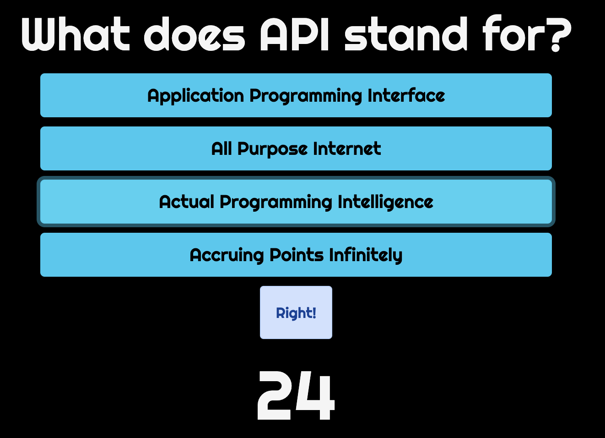

# Code Quiz

## Description

Test your knowledge of coding with this fun and easy to use quiz!

## Usage

- Once the user starts the quiz, they are presented with a question pertaining to coding
- The user is presented with 4 options of possible correct answers to the question
- After the user makes a selection, they are alerted to whether their answer was "Right" or "Wrong"
- The user is then presented with the next question in the quiz
- At the end of the quiz, the user is prompted to enter their initials and try the quiz again

## Features

- User-friendly style & layout
- Start button to commence quiz
- Buttons for selecting a possible answer to a question
- Timer that deducts time when the user answers a question incorrectly
- Final score that is generated at the end of the quiz
- List of high scores so the user can compare their progress
- Try Again button for the user to take the quiz again

## Screenshots

## Link to Repo

https://github.com/mfandel118/Code-Quiz-Homework4
